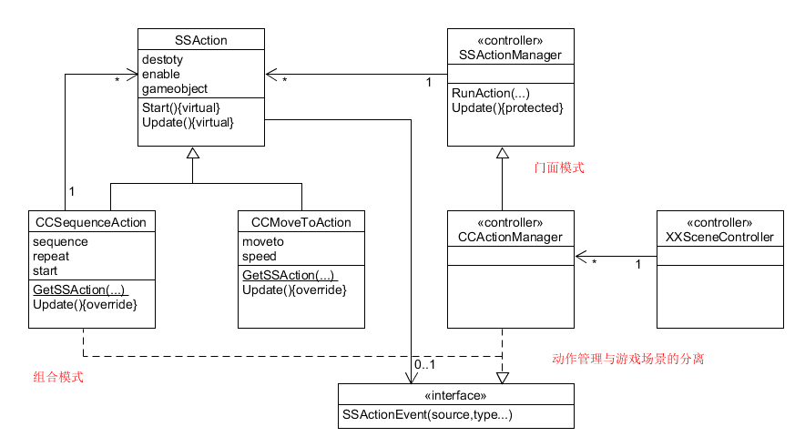

<!-- TOC -->

- [Fantasy Skybox Free](#fantasy-skybox-free)
    - [下载Fantasy Skybox Free并导入](#下载fantasy-skybox-free并导入)
    - [创建material](#创建material)
    - [地形](#地形)
    - [总结](#总结)
- [牧师与魔鬼V2](#牧师与魔鬼v2)
    - [该版本改进的目的](#该版本改进的目的)
    - [UML图](#uml图)
    - [动作管理类图描述与实现](#动作管理类图描述与实现)
        - [动作事件接口ISSActionCallback](#动作事件接口issactioncallback)
        - [动作管理基类SSActionManager](#动作管理基类ssactionmanager)
        - [移动动作实现CCMoveToAction](#移动动作实现ccmovetoaction)
        - [组合动作实现](#组合动作实现)
        - [动作基类](#动作基类)
        - [移动动作管理实现](#移动动作管理实现)
        - [裁判类](#裁判类)

<!-- /TOC -->

# Fantasy Skybox Free

## 下载Fantasy Skybox Free并导入


## 创建material

创建一个Material，并且在Inspector中的Shader选择为Skybox->6 Sided，并且拖入文件夹中的天空材质图


然后选取摄像机对象，增加Component——Rendering，选择为Skybox，并拖入制作好的Material。


## 地形

创建地形，我们可以直接使用 Fantasy Skybox FREE中的地形，也可以自己创建自己的地形。我这里直接用了自带的地形。

如图：


## 总结

首先游戏对象包括常规的3D和2D对象，还包括摄像机和光源等这种特殊对象。每个对象都有自己的相关属性（如材质，位置等等），还可以附加component（脚本等），对象之前也可以有附属关系，对象还可以通过脚本来创建。


# 牧师与魔鬼V2

## 该版本改进的目的

1. 把每个需要移动的游戏对象的移动方法提取出来，建立一个动作管理器来管理不同的移动方法。
2. 对于上一个版本，每一个可移动的游戏对象的组件都有一个Move脚本，当游戏对象需要移动时候，游戏对象自己调用Move脚本中的方法让自己移动。而动作分离版，则剥夺了游戏对象自己调用动作的能力，建立一个动作管理器，通过场景控制器把需要移动的游戏对象传递给动作管理器，让动作管理器去移动游戏对象。
3. 当动作很多或是需要做同样动作的游戏对象很多的时候，使用动作管理器可以让动作很容易管理，也提高了代码复用性

## UML图



## 动作管理类图描述与实现

### 动作事件接口ISSActionCallback

动作管理者继承该接口，并实现接口方法。当动作完成时，动作会发送消息告诉管理者动作已经完成。

```c#
public interface ISSActionCallback {
    void SSActionEvent(SSAction source,
        SSActionEventType events = SSActionEventType.Completed,
        int intParam = 0,
        string strParam = null,
        Object objectParam = null);
}

```

### 动作管理基类SSActionManager

继承了`ISSActionCallback`，通过该接口当动作做完或是连续的动作做完时候会告诉`SSActionManager`，然后`SSActionManager`去决定如何执行下一个动作。

```C#
public class SSActionManager : MonoBehaviour {  //SSActionManager的实现借鉴了网上的CSDN博客

    private Dictionary<int, SSAction> actions = new Dictionary<int, SSAction> ();
    private List<SSAction> waitingAdd = new List<SSAction>();
    private List<int> waitingDelete = new List<int>();
    protected void Update() {
        foreach (SSAction ac in waitingAdd) {
            actions[ac.GetInstanceID()] = ac;
        }
        waitingAdd.Clear();
        foreach (KeyValuePair<int, SSAction> kv in actions) {
            SSAction ac = kv.Value;
            if (ac.destory) {
                waitingDelete.Add(ac.GetInstanceID());
            } else if (ac.enable) {
                ac.Update();
            }
        }
        foreach(int key in waitingDelete) {
            SSAction ac = actions[key];
            actions.Remove(key);
            DestroyObject(ac);
        }
        waitingDelete.Clear();
    }

    public void RunAction(GameObject gameobject, SSAction action, ISSActionCallback manager) {
        action.gameobject = gameobject;
        action.transform = gameobject.transform;
        action.callback = manager;
        waitingAdd.Add(action);
        action.Start();
    }

    protected void Start() {}
}
```

### 移动动作实现CCMoveToAction

该类是将一个物体移动到目标位置并告诉管理者任务完成，这个类局限性在于它只能进行直线运动，不能转弯。

```c#
public class CCMoveToAction : SSAction {
    public Vector3 target;
    public float speed;

    public static CCMoveToAction GetSSAction (Vector3 target, float speed) {
        CCMoveToAction action = ScriptableObject.CreateInstance<CCMoveToAction>();
        action.target = target;
        action.speed = speed;
        return action;
    }

    public override void Update () {
        this.transform.position = Vector3.MoveTowards (this.transform.position, target, speed * Time.deltaTime);
        if (this.transform.position == target) {
            this.destory = true;
            this.callback.SSActionEvent (this);
        }
    }

    public override void Start () {}
}
```

### 组合动作实现

CCMoveToAction 只是一个能够直线运动的模版，这个类就是将上面的类组合起来，由于model的动作都是直线运动，所以无需在创建其他类，对于人物来说他们的动作是折线运动，组合一下就好

```c#
public class CCSequenceAction : SSAction, ISSActionCallback {

    public List<SSAction> sequence;
    public int start = 0;


    public static CCSequenceAction GetSSAction (int start, List<SSAction> sequence) {
        CCSequenceAction action = ScriptableObject.CreateInstance<CCSequenceAction> ();
        action.sequence = sequence;
        action.start = start;
        return action;
    }

    public override void Update () {
        if (sequence.Count == 0) return;
        if (start < sequence.Count) {
            sequence [start].Update ();
        }
    }

    public void SSActionEvent (SSAction source, SSActionEventType events = SSActionEventType.Completed, int Param = 0, string strParam = null, Object objectParam = null) {
        source.destory = false;
        this.start++;
        if (this.start >= sequence.Count) {
            this.start = 0;
            this.destory = true;
            this.callback.SSActionEvent(this);
        }
    }
    // Use this for initialization
    public override void Start () {
        foreach (SSAction action in sequence) {
            action.gameobject = this.gameobject;
            action.transform = this.transform;
            action.callback = this;
            action.Start();
        }
    }

    void OnDestory() {}
}
```

### 动作基类

该类是所有动作的基类，该类不需要绑定任何GameObject对象，受unity引擎场景管理。

```c#
public class SSAction : ScriptableObject {

    public bool enable = true;
    public bool destory = false;

    public GameObject gameobject{ get; set;}
    public Transform transform{ get; set; }
    public ISSActionCallback callback{ get; set; }

    protected SSAction() {}

    public virtual void Start () {
        throw new System.NotImplementedException();
    }

    public virtual void Update () {
        throw new System.NotImplementedException ();
    }
}
```

### 移动动作管理实现

该类实现了船的来回移动，人物的上下船的动作。

```c#
public class CCActionManager : SSActionManager, ISSActionCallback
{
    public void moveBoat(GameObject boat,int type){
        if(type == 1){
            Vector3 target = new Vector3(3, 0, 10);
            CCMoveToAction action=CCMoveToAction.GetSSAction(target, 3f);
            this.RunAction(boat, action, this);
        }
        else if(type == 0){
            Vector3 target = new Vector3(-3, 0, 10);
            CCMoveToAction action=CCMoveToAction.GetSSAction(target, 3f);
            this.RunAction(boat, action, this);
        }
    }

    public void moveMan(GameObject man,int type,int i){
        if(type==1){
            Vector3 target = new Vector3(-3 + i*0.6f, 0.8f, 10);
            CCMoveToAction action=CCMoveToAction.GetSSAction(target, 3f);
            this.RunAction(man, action, this);
        }
        else if(type==0){
            Vector3 target = new Vector3(3 + i*0.6f, 0.8f, 10);
            CCMoveToAction action=CCMoveToAction.GetSSAction(target, 3f);
            this.RunAction(man, action, this);
        }
    }

    public void onBoat(GameObject man,int type,int i){
            if(type==1){
                Vector3 target1 = man.transform.position + new Vector3(0, 1 ,0);
                CCMoveToAction action1=CCMoveToAction.GetSSAction(target1, 10f);
                Vector3 target2 = new Vector3(3, 0.8f, 10) + new Vector3(0.6f * (0 - i), 0, 0);
                CCMoveToAction action2=CCMoveToAction.GetSSAction(target2, 10f);
                List<SSAction> sequence = new List<SSAction>();
                sequence.Add(action1);
                sequence.Add(action2);
                CCSequenceAction ssaction = CCSequenceAction.GetSSAction(0, sequence);
                this.RunAction(man, ssaction, this);

            } else if (type==0) {
Vector3 target1 = man.transform.position + new Vector3(0, 1 ,0);
                CCMoveToAction action1=CCMoveToAction.GetSSAction(target1, 10f);
                Vector3 target2 = new Vector3(-3, 0.8f, 10) + new Vector3(0.6f * (0 + i), 0, 0);
                CCMoveToAction action2=CCMoveToAction.GetSSAction(target2, 10f);
                List<SSAction> sequence = new List<SSAction>();
                sequence.Add(action1);
                sequence.Add(action2);
                CCSequenceAction ssaction = CCSequenceAction.GetSSAction(0, sequence);
                this.RunAction(man, ssaction, this);
            }
    }

    public void offBoat(GameObject man, int type,int i,int type2){
            if(type==1){
                Vector3 target1 = man.transform.position + new Vector3(0, 1 ,0);
                CCMoveToAction action1=CCMoveToAction.GetSSAction(target1, 5f);
                Vector3 target2 = new Vector3(0, 0, 0);
                if(type2==0){
                    target2 += new Vector3(-4.6f, 0.8f, 10) + new Vector3(0.6f * (0 - i), 0, 0);
                } else if(type2==1){
                    target2 += new Vector3(-6, 0.8f, 10) + new Vector3(0.6f * (0 - i), 0, 0);
                }
                CCMoveToAction action2=CCMoveToAction.GetSSAction(target2, 5f);
                List<SSAction> sequence = new List<SSAction>();
                sequence.Add(action1);
                sequence.Add(action2);
                CCSequenceAction ssaction = CCSequenceAction.GetSSAction(0, sequence);
                this.RunAction(man, ssaction, this);
            } else if(type==0){
                Vector3 target1 = man.transform.position + new Vector3(0, 1 ,0);
                CCMoveToAction action1=CCMoveToAction.GetSSAction(target1, 5f);
                Vector3 target2 = new Vector3(0, 0, 0);
                if(type2==0){
                    target2 += new Vector3(4.6f, 0.8f, 10) + new Vector3(0.6f * (0 + i), 0, 0);
                } else if(type2==1){
                    target2 += new Vector3(6, 0.8f, 10) + new Vector3(0.6f * (0 + i), 0, 0);
                }
                CCMoveToAction action2=CCMoveToAction.GetSSAction(target2, 5f);
                List<SSAction> sequence = new List<SSAction>();
                sequence.Add(action1);
                sequence.Add(action2);
                CCSequenceAction ssaction = CCSequenceAction.GetSSAction(0, sequence);
                this.RunAction(man, ssaction, this);
            }
    }

    public void SSActionEvent(SSAction source,SSActionEventType events = SSActionEventType.Completed,
        int intParam = 0,
        string strParam = null,
        Object objectParam = null) {
        
    }

    // Start is called before the first frame update
    void Start()
    {
        
    }

    // Update is called once per frame
    void Update()
    {
        // Debug.Log("update!");
        base.Update();
    }
}
```

### 裁判类

增加裁判类，通过两边岸上和船上的人数和类型进行判断游戏输赢。

```c#
public class Referee : MonoBehaviour
{
    // Start is called before the first frame update

    public int check1(Stack<GameObject> LeftPriests, Stack<GameObject> LeftDevils, Stack<GameObject> RightPriests, Stack<GameObject> RightDevils){
        if ((LeftPriests.Count!=0&&LeftDevils.Count > LeftPriests.Count) || (RightDevils.Count > RightPriests.Count&&RightPriests.Count!=0))
        {
            return 1;
        }
        else{
            return 0;
        }
    }

    public int check2(Stack<GameObject> LeftPriests, Stack<GameObject> LeftDevils, Stack<GameObject> RightPriests, Stack<GameObject> RightDevils){
        if (LeftPriests.Count == 3 && LeftDevils.Count == 3)
        {
            return 1;
        }
        else{
            return 0;
        }
    }

    void Start()
    {
        
    }

    // Update is called once per frame
    void Update()
    {
        
    }
}
```

[演示视频](https://www.bilibili.com/video/BV1Sa411w7EV)
[asset链接](https://github.com/AdamCXY/unity3D/tree/main/homework4/Assets)