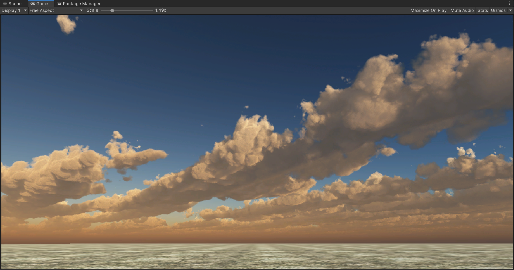
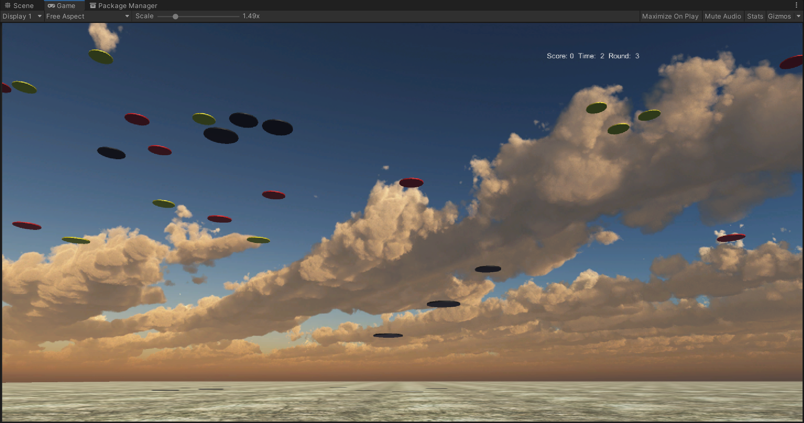

# 改进飞碟游戏

## 游戏内容要求

- 按 adapter模式 设计图修改飞碟游戏
- 使它同时支持物理运动与运动学（变换）运动

## 游戏组织结构

这次按照Adapter模式重写了飞碟的控制逻辑，其中RoundController其实就是场记FirstSceneController。上一次我是通过CCActionManager的实例来调用使飞碟运动的方法，这次将方法分离，使用接口IActionManager来发射飞碟，场记与具体运动控制器并不直接连接。

## 代码组织结构

### 接口类IActionManager

首先按照需求，我们需要添加接口类IActionManager，它主要用于链接场记和运动管理器，使飞碟运动和判断所以飞碟都已经被回收。

```c#
    namespace Interfaces
    {
        public interface ISceneController
        {
            void LoadResources();
        }

        public interface UserAction
        {
            void Hit(Vector3 pos);
            void Restart();
            int GetScore();
            bool RoundStop();
            int GetRound();
        }

        public enum SSActionEventType : int { Started, Completed }

        public interface SSActionCallback
        {
            void SSActionCallback(SSAction source);
        }

        public interface IActionManager
        {
            void PlayDisk(Disk disk);
            bool IsAllFinished(); //主要为了防止游戏结束时场景还有对象但是GUI按钮已经加载出来
        }
    }
```

### 改写运动管理CCActionManager

底层运动管理也是不需要重写的，需要重写的主要是用户层的运动管理CCActionManager，主要就是添加继承的接口和重写继承的接口的函数。

```c#
    public class CCActionManager : SSActionManager, SSActionCallback, IActionManager
    {
        int count = 0;//记录所有在移动的碟子的数量
        public SSActionEventType Complete = SSActionEventType.Completed;

        public void PlayDisk(Disk disk)
        {
            count++;
            Complete = SSActionEventType.Started;
            CCMoveToAction action = CCMoveToAction.getAction(disk.speed);
            addAction(disk.gameObject, action, this);
        }

        public void SSActionCallback(SSAction source) //运动事件结束后的回调函数
        {
            count--;
            Complete = SSActionEventType.Completed;
            source.gameObject.SetActive(false);
        }

        public bool IsAllFinished() //主要为了防止游戏结束时场景还有对象但是GUI按钮已经加载出来
        {
            if (count == 0) return true;
            else return false;
        }
    }
```

### 运动控制类

这次主要的任务还有写一个基于Unity物理引擎的运动控制类，我觉得是使用刚体属性以及施加力来实现。首先需要写一个用户层的物理运动管理CCPhysisActionManager，其实基本和CCActionManager是一样的，只要区别是底层使用的是CCPhysisAction来实例化运动对象。

```c#
    public class CCPhysisActionManager : SSActionManager, SSActionCallback, IActionManager
    {
        int count = 0;//记录所有在移动的碟子的数量
        public SSActionEventType Complete = SSActionEventType.Completed;

        public void PlayDisk(Disk disk)
        {
            count++;
            Complete = SSActionEventType.Started;
            CCPhysisAction action = CCPhysisAction.getAction(disk.speed); //实例化为物理运动对象
            addAction(disk.gameObject, action, this);
        }

        public void SSActionCallback(SSAction source) //运动事件结束后的回调函数
        {
            count--;
            Complete = SSActionEventType.Completed;
            source.gameObject.SetActive(false);
        }

        public bool IsAllFinished() //主要为了防止游戏结束时场景还有对象但是GUI按钮已经加载出来
        {
            if (count == 0) return true;
            else return false;
        }
    }
```

### 物理运动管理类CCPhysisAction

添加具体的物理运动管理类CCPhysisAction，同样是继承自SSAction，在Start初始化的时候添加刚体属性，并且添加X轴上持续的速度ForceMode.VelocityChange，由于重力加速度太大导致画面上飞碟速度太大，只能使用流氓方法添加持续向上的一半的重力使重力加速度减小为g/2。然后当游戏对象到达地面时，由于飞碟工厂的存在，一定要销毁对象的刚体属性否则速度会累积。

```c#
    public class CCPhysisAction : SSAction
    {
        public float speedx;
        // Use this for initialization
        public override void Start ()
        {
            if (!this.gameObject.GetComponent<Rigidbody>())
            {
                this.gameObject.AddComponent<Rigidbody>();
            }
            this.gameObject.GetComponent<Rigidbody>().AddForce(Vector3.up * 9.8f * 0.6f, ForceMode.Acceleration);
            this.gameObject.GetComponent<Rigidbody>().AddForce(new Vector3(speedx, 0, 0), ForceMode.VelocityChange);
        }

        private CCPhysisAction()
        {
            
        }
        public static CCPhysisAction getAction(float speedx)
        {
            CCPhysisAction action = CreateInstance<CCPhysisAction>();
            action.speedx = speedx;
            return action;
        }

        // Update is called once per frame
        override public void Update ()
        {
            if (transform.position.y <= 3)
            {
                Destroy(this.gameObject.GetComponent<Rigidbody>());//如果不移除刚体属性会导致前面添加的速度属性累积。
                destroy = true;
                CallBack.SSActionCallback(this);
            }
        }
    }
```

## 成果图

（其实看上去和上次的没什么区别，就没录视频了）




代码assets见当前目录下。