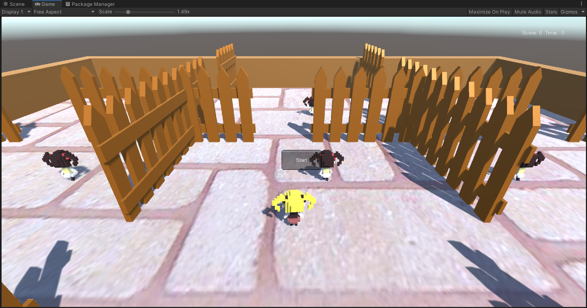

<!-- TOC -->

- [1. Unity3D-巡逻兵](#1-unity3d-巡逻兵)
    - [1.1. 游戏设计要求](#11-游戏设计要求)
    - [1.2. 程序设计过程](#12-程序设计过程)
        - [1.2.1. 素材选用](#121-素材选用)
        - [1.2.2. 代码组织结构](#122-代码组织结构)
            - [1.2.2.1. 接口设计](#1221-接口设计)
            - [1.2.2.2. 区域碰撞和巡逻兵碰撞](#1222-区域碰撞和巡逻兵碰撞)
            - [1.2.2.3. 游戏事件管理器](#1223-游戏事件管理器)
            - [1.2.2.4. 追踪与巡逻动作](#1224-追踪与巡逻动作)
                - [1.2.2.4.1. 角色移动](#12241-角色移动)
                - [1.2.2.4.2. 追踪动作](#12242-追踪动作)
    - [1.3. 成果演示](#13-成果演示)
    - [1.4. 视频连接](#14-视频连接)

<!-- /TOC -->

# 1. Unity3D-巡逻兵

## 1.1. 游戏设计要求

- 创建一个地图和若干巡逻兵(使用动画)；
- 每个巡逻兵走一个3~5个边的凸多边型，位置数据是相对地址。即每次确定下一个目标位置，用自己当前位置为原点计算；
- 巡逻兵碰撞到障碍物，则会自动选下一个点为目标；
- 巡逻兵在设定范围内感知到玩家，会自动追击玩家；
- 失去玩家目标后，继续巡逻；

## 1.2. 程序设计过程

### 1.2.1. 素材选用

素材这块直接去网上随便下一点就好了，不用纠结（我是直接看的学长的代码学的，所以直接将素材一起扒过来了）

### 1.2.2. 代码组织结构

#### 1.2.2.1. 接口设计

接口类声明在命名空间Interface中，UserAction类中主要为GUI和场景控制器交互的的方法，SSActionCallback中则为运动控制器的回调函数。游戏场景控制器FirstSceneController类继承了接口ISceneController和UserAction，并且在其中实现了接口声明的函数。场景控制器还是订阅者，在初始化时将自身相应的事件处理函数提交给消息处理器，在相应事件发生时被自动调用。

```c#
namespace Interfaces
{
    public interface ISceneController
    {
        void LoadResources();
    }

    public interface UserAction
    {
        int GetScore();
        void Restart();
        bool GetGameState();
        //移动玩家
        void MovePlayer(float translationX, float translationZ);
    }

    public enum SSActionEventType : int { Started, Completed }

    public interface SSActionCallback
    {
        void SSActionCallback(SSAction source);
    }
}
---------------------
public class FirstSceneController : MonoBehaviour, ISceneController, UserAction
{
    GameObject player = null;
    PropFactory PF;
    int score = 0;
    int PlayerArea = 4;
    bool gameState = false;
    Dictionary<int, GameObject> allProp = null;
    CCActionManager CCManager = null;

    void Awake()
    {
        SSDirector director = SSDirector.getInstance();
        director.currentScenceController = this;
        PF = PropFactory.PF;
        if(CCManager == null) CCManager = gameObject.AddComponent<CCActionManager>();
        if (player == null && allProp == null)
        {
            Instantiate(Resources.Load<GameObject>("Prefabs/Plane"), new Vector3(0, 0, 0), Quaternion.identity);
            player = Instantiate(Resources.Load("Prefabs/Player"), new Vector3(0, 0, 0), Quaternion.identity) as GameObject;
            allProp = PF.GetProp();
        }
        if (player.GetComponent<Rigidbody>())
        {
            player.GetComponent<Rigidbody>().freezeRotation = true;
        }
    }

    // Update is called once per frame
    void Update () {
        //防止碰撞带来的移动
        if (player.transform.localEulerAngles.x != 0 || player.transform.localEulerAngles.z != 0)
        {
            player.transform.localEulerAngles = new Vector3(0, player.transform.localEulerAngles.y, 0);
        }
        if (player.transform.position.y <= 0)
        {
            player.transform.position = new Vector3(player.transform.position.x, 0, player.transform.position.z);
        }
    }

    void OnEnable()
    {
        GameEventManager.ScoreChange += AddScore;
        GameEventManager.GameoverChange += Gameover;
    }

    void OnDisable()
    {
        GameEventManager.ScoreChange -= AddScore;
        GameEventManager.GameoverChange -= Gameover;
    }

    public void LoadResources()
    {
        
    }

    public int GetScore()
    {
        return score;
    }

    public void Restart()
    {
        player.GetComponent<Animator>().Play("New State");
        PF.StopPatrol();
        gameState = true;
        score = 0;
        player.transform.position = new Vector3(0, 0, 0);
        allProp[PlayerArea].GetComponent<Prop>().follow_player = true;
        CCManager.Tracert(allProp[PlayerArea], player);
        foreach (GameObject x in allProp.Values)
        {
            if (!x.GetComponent<Prop>().follow_player)
            {
                CCManager.GoAround(x);
            }
        }
    }

    public bool GetGameState()
    {
        return gameState;
    }
    public void SetPlayerArea(int x)
    {
        if (PlayerArea != x && gameState)
        {
            allProp[PlayerArea].GetComponent<Animator>().SetBool("run", false);
            allProp[PlayerArea].GetComponent<Prop>().follow_player = false;
            PlayerArea = x;
        }
    }

    void AddScore()
    {
        if (gameState)
        {
            ++score;
            allProp[PlayerArea].GetComponent<Prop>().follow_player = true;
            CCManager.Tracert(allProp[PlayerArea], player);
            allProp[PlayerArea].GetComponent<Animator>().SetBool("run", true);
        }
    }

    void Gameover()
    {
        CCManager.StopAll();
        allProp[PlayerArea].GetComponent<Prop>().follow_player = false;
        player.GetComponent<Animator>().SetTrigger("death");
        gameState = false;
    }

    //玩家移动
    public void MovePlayer(float translationX, float translationZ)
    {
        if (gameState&&player!=null)
        {
            if (translationX != 0 || translationZ != 0)
            {
                player.GetComponent<Animator>().SetBool("run", true);
            }
            else
            {
                player.GetComponent<Animator>().SetBool("run", false);
            }
            //移动和旋转
            player.transform.Translate(0, 0, translationZ * 4f * Time.deltaTime);
            player.transform.Rotate(0, translationX * 50f * Time.deltaTime, 0);
        }
    }
}

```

#### 1.2.2.2. 区域碰撞和巡逻兵碰撞

该项为检验游戏进程情况的重要代码，当巡逻兵和人物碰撞时就会直接结束游戏，而触碰到区域范围则不能再仅需前进了。

这里也分为两种情况：

- 有元素进入区域时，判断进入区域的对象是否为玩家“Player”。如果是玩家，区域将调用事件管理器发布玩家进入新区域的事件。

- 当巡逻兵发生碰撞时，判断碰撞对象是否为玩家。如果是玩家，调用事件管理器发表游戏结束的消息。

```c#
public class AreaCollide : MonoBehaviour
{
    public int sign = 0;
    FirstSceneController sceneController;
    private void Start()
    {
        sceneController = SSDirector.getInstance().currentScenceController as FirstSceneController;
    }
    void OnTriggerEnter(Collider collider)
    {
        //标记玩家进入自己的区域
        if (collider.gameObject.tag == "Player")
        {
            sceneController.SetPlayerArea(sign);
            GameEventManager.Instance.PlayerEscape();
        }
    }
}
/*

*/
public class PlayerCollide : MonoBehaviour
{

    void OnCollisionEnter(Collision other)
    {
        //当玩家与侦察兵相撞
        if (other.gameObject.tag == "Player")
        {
            GameEventManager.Instance.PlayerGameover();
        }
    }
}


```

#### 1.2.2.3. 游戏事件管理器

>游戏事件管理器是订阅与发布模式中的中继者，消息的订阅者通过与管理器中相应的事件委托绑定，在管理器相应的函数被发布者调用（也就是发布者发布相应消息时），订阅者绑定的相应事件处理函数也会被调用。订阅与发布模式实现了一部分消息的发布者和订阅者之间的解耦，让发布者和订阅者不必产生直接联系。

```c#
public class GameEventManager
{
    public static GameEventManager Instance = new GameEventManager();
    //计分委托
    public delegate void ScoreEvent();
    public static event ScoreEvent ScoreChange;
    //游戏结束委托
    public delegate void GameoverEvent();
    public static event GameoverEvent GameoverChange;

    private GameEventManager() { }

    //玩家逃脱进入新区域
    public void PlayerEscape()
    {
        if (ScoreChange != null)
        {
            ScoreChange();
        }
    }
    //玩家被捕，游戏结束
    public void PlayerGameover()
    {
        if (GameoverChange != null)
        {
            GameoverChange();
        }
    }
}
```

#### 1.2.2.4. 追踪与巡逻动作

##### 1.2.2.4.1. 角色移动

场记通过动作管理器CCActionManager管理对象的移动，CCActionManager实现了追踪Tracert，巡逻GoAround方法，并通过回调函数来循环执行巡逻动作或者在追踪结束时继续巡逻动作。

```c#
public class CCActionManager : SSActionManager, SSActionCallback
{
    public SSActionEventType Complete = SSActionEventType.Completed;
    Dictionary<int,CCMoveToAction> actionList = new Dictionary<int, CCMoveToAction>();

    public void Tracert(GameObject p,GameObject player)
    {
        if (actionList.ContainsKey(p.GetComponent<Prop>().block)) actionList[p.GetComponent<Prop>().block].destroy = true;
        CCTracertAction action = CCTracertAction.getAction(player, 0.8f);
        addAction(p.gameObject, action, this);
    }

    public void GoAround(GameObject p)
    {
        CCMoveToAction action = CCMoveToAction.getAction(p.GetComponent<Prop>().block,0.6f,GetNewTarget(p));
        actionList.Add(p.GetComponent<Prop>().block, action);
        addAction(p.gameObject, action, this);
    }

    private Vector3 GetNewTarget(GameObject p)
    {
        Vector3 pos = p.transform.position;
        int block = p.GetComponent<Prop>().block;
        float ZUp = 13.2f - (block / 3) * 9.65f;
        float ZDown = 5.5f - (block / 3) * 9.44f;
        float XUp = -4.7f + (block % 3) * 8.8f;
        float XDown = -13.3f + (block % 3) * 10.1f;
        Vector3 Move = new Vector3(Random.Range(-2f, 2f), 0, Random.Range(-2f, 2f));
        Vector3 Next = pos + Move;
        while (!(Next.x<XUp && Next.x>XDown && Next.z<ZUp && Next.z > ZDown))
        {
            Move = new Vector3(Random.Range(-1f, 1f), 0, Random.Range(-1f, 1f));
            Next = pos + Move;
        }
        return Next;
    }

    public void StopAll()
    {
        foreach(CCMoveToAction x in actionList.Values)
        {
            x.destroy = true;
        }
        actionList.Clear();
    }

    public void SSActionCallback(SSAction source)
    {
        if(actionList.ContainsKey(source.gameObject.GetComponent<Prop>().block)) actionList.Remove(source.gameObject.GetComponent<Prop>().block);
        GoAround(source.gameObject);
    }
}
```

##### 1.2.2.4.2. 追踪动作

追踪动作在动作管理器CCActionManager类中实现了Tracert函数，传入了追踪者和被追踪的对象也就是玩家对象。创建了追踪事件，在追上玩家或者追踪标志follow_player被置为false前一直追着玩家（当碰撞事件发生时追踪者的追踪标志会被场记设置为false）。

```c#
public class CCTracertAction : SSAction
{
    public GameObject target;
    public float speed;

    private CCTracertAction() { }
    public static CCTracertAction getAction(GameObject target, float speed)
    {
        CCTracertAction action = ScriptableObject.CreateInstance<CCTracertAction>();
        action.target = target;
        action.speed = speed;
        return action;
    }

    public override void Update()
    {
        this.transform.position = Vector3.MoveTowards(transform.position, target.transform.position, speed * Time.deltaTime);
        Quaternion rotation = Quaternion.LookRotation(target.transform.position - gameObject.transform.position, Vector3.up);
        gameObject.transform.rotation = rotation;
        if (gameObject.GetComponent<Prop>().follow_player == false||transform.position == target.transform.position)
        {
            destroy = true;
            CallBack.SSActionCallback(this);
        }
    }

    public override void Start()
    {

    }
}
```

## 1.3. 成果演示




## 1.4. 视频连接

[神秘链接](https://www.bilibili.com/video/bv1dK411G77Q)

鸣谢师兄们的详细指导，pml大好人！

