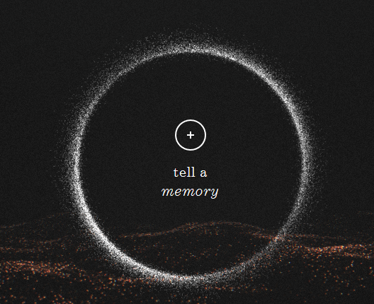
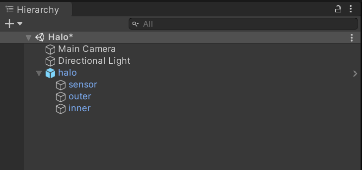
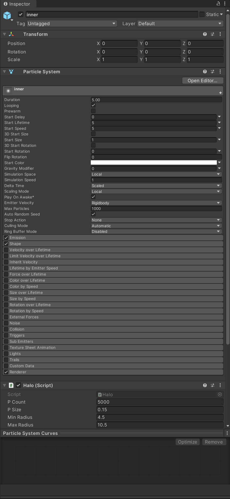
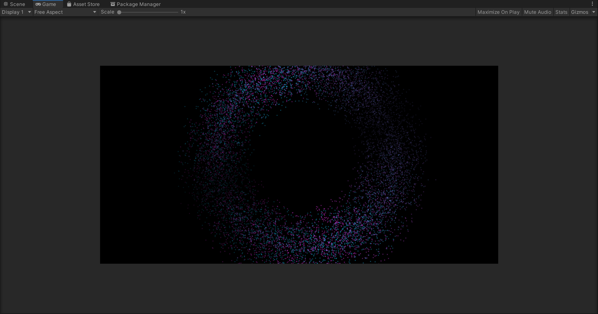

<!-- TOC -->

- [1. 简单粒子效果](#1-简单粒子效果)
    - [1.1. 具体实现](#11-具体实现)
        - [1.1.1. 观察](#111-观察)
        - [1.1.2. 项目结构](#112-项目结构)
        - [1.1.3. 代码控制](#113-代码控制)
    - [1.2. 参考资料](#12-参考资料)

<!-- /TOC -->

# 1. 简单粒子效果

## 1.1. 具体实现

### 1.1.1. 观察

模仿i-remember首页的效果制作了一个粒子光环，这个网站经常打不开，就没截图。首先观察效果，它是两个粒子环在转动，然后环的某一部分比较亮，亮部以比粒子更快的速度在旋转，有一种“涌动”的效果。鼠标移动到中间的按钮上光环会以一种很好看的方式迅速收缩，收缩之后有一种刹车的感觉。



下面开始制作。

### 1.1.2. 项目结构



新建一个空对象halo，

- outer和inner是两个光环，挂了粒子系统和自己写的控制脚本，如果是新建空对象再挂的粒子系统记得加上材质，不然就是你在unity里最不想看到那个颜色



- sensor是检测鼠标是否移到中心的，挂一个球形碰撞器，勾上触发器并调整位置。

然后把halo做成预制体就行了。

### 1.1.3. 代码控制

首先是跟着前辈的博客做了一遍，这次更多的是学习。

最终实现的运动是一个环中每个粒子朝同一方向做圆周运动，切向的速度分成几个层次，每个层次不一样，同时每个粒子在径向做不规则的抖动，鼠标移动到中心时整个环收缩，移开后再展开。

- 新建C#脚本， 首先定义了一个新的类CirclePosition，用来记录每个粒子的当前半径、角度和时间，其中时间是做游离运动需要的。 

  ```c#
  public class CirclePosition {
      public float radius = 0f, angle = 0f, time = 0f;
      public CirclePosition(float radius, float angle, float time) {
          this.radius = radius;   // 半径
          this.angle = angle;     // 角度
          this.time = time;       // 时间
      }
  }
  ```

- 基本的变量如下：

  ```c#
  private ParticleSystem particleSys;                       		// 粒子系统
  private ParticleSystem.Particle[] particleArr;                  // 粒子数组
  private CirclePosition[] circle;                                // 极坐标数组
  public int pCount = 5000;                                       // 粒子数量
  public float pSize = 0.15f;                                     // 粒子大小
  public float minRadius = 4.0f;                                  // 最小半径
  public float maxRadius = 11.0f;                                 // 最大半径
  public bool clockwise = true;                                   // 旋转方向
  public float speed = 1f;                                        // 速度
  public float pingPong = 0.01f;                                  // 游离范围
  public int tier = 10;                                           // 速度差分层数
  ```

- 初始化粒子，在光环中间部分粒子分布多一些，边缘少一些，代码就不放了，与前辈的相同。

- 切向运动：让光环旋转起来，在Update里逐渐改变每个粒子地角度。同时用上差分层数tier让每一层的粒子速度都不同，`i % tier + 1`中的 “+1” 是为了不出现不运动的粒子。

```c#
  if (clockwise) circle[i].angle -= (i % tier + 1) * (speed / circle[i].radius / tier);
  else circle[i].angle += (i % tier + 1) * (speed / circle[i].radius / tier);
  // 保证angle在0~360度
  circle[i].angle = (360.0f + circle[i].angle) % 360.0f; 
  
  float theta = circle[i].angle / 180 * Mathf.PI;
  particleArr[i].position = new Vector3(circle[i].radius * Mathf.Cos(theta), 0f, circle[i].radius * Mathf.Sin(theta)); 
```

- 径向不规则运动：让每个粒子不那么死板，随机抖动，用了Mathf类的PingPong方法，算是锦上添花吧。[官方API]( https://docs.unity3d.com/ScriptReference/Mathf.PingPong.html )

```C#
// 粒子在半径方向上游离
  circle[i].time += Time.deltaTime;
  circle[i].radius += Mathf.PingPong(circle[i].time / minRadius / maxRadius, pingPong) - pingPong / 2.0f;
```
  
这里的pingpong是游离范围，最后`- pingpong / 2.0f`是为了radius有增有减，不过中间为什么要除最小半径和最大半径没怎么看懂。。。
  
- 径向随鼠标收缩运动：

```C#
  /*增加成员*/
  private float[] before;                                         // 收缩前粒子位置
  private float[] after;                                          // 收缩后粒子位置
  public float shrinkSpeed = 5f;                                  // 粒子缩放的速度
  private bool ischange = false;                                  // 是否收缩
  
  /*初始化RandomlySpread*/
  before[i] = radius;
  after[i] = 0.7f * radius;
  if (after[i] < minRadius * 1.1f) {
      after[i] = Random.Range(Random.Range(minRadius, midRadius), (minRadius * 1.1f));
  }
  
  /*更新Update*/
  if (ischange) {
      // 开始收缩
      if (circle[i].radius > after[i]) {
          circle[i].radius -= shrinkSpeed * (circle[i].radius / after[i]) * Time.deltaTime;
      }
  }
  else {
      // 开始还原
      if (circle[i].radius < before[i]) {
          circle[i].radius += shrinkSpeed * (before[i] / circle[i].radius) * Time.deltaTime;
      }
  }
```

- 颜色与透明度变化：

最后做出来是这个样子，



```C#
  /*增加成员*/
  public Gradient colorGradient;                                  // 颜色渐变
  private GradientAlphaKey[] alphaKeys;                           // 透明度
  private GradientColorKey[] colorKeys;                           // 颜色
  
  /*Start()*/
  alphaKeys[0].time = 0.0f; alphaKeys[0].alpha = 0.2f;
  alphaKeys[1].time = 0.25f; alphaKeys[1].alpha = 1f;
  alphaKeys[2].time = 0.5f; alphaKeys[2].alpha = 0.2f;
  alphaKeys[3].time = 0.75f; alphaKeys[3].alpha = 1f;
  alphaKeys[4].time = 1.0f; alphaKeys[4].alpha = 0.2f;
  
  if(clockwise) {
      colorKeys[0].time = 0.25f; colorKeys[0].color = new Color(221f / 255, 49f / 255, 221f / 255);
      colorKeys[1].time = 0.75f; colorKeys[1].color = new Color(24f / 255, 177f / 255, 224f / 255);
  }
  else {
      colorKeys[0].time = 0.25f; colorKeys[0].color = new Color(24f / 255, 177f / 255, 224f / 255);
      colorKeys[1].time = 0.75f; colorKeys[1].color = new Color(221f / 255, 49f / 255, 221f / 255);
  }
  colorGradient.SetKeys(colorKeys, alphaKeys);
```

## 1.2. 参考资料

[项目链接](https://github.com/caoxy7/unity3D/tree/main/hw8/Assets)

[Unity3D官方文档]( https://docs.unity3d.com/ScriptReference/ParticleSystem.MainModule.html )

[前辈博客(大神神作，无人超越) ]( https://blog.csdn.net/simba_scorpio/article/details/51251126 )
