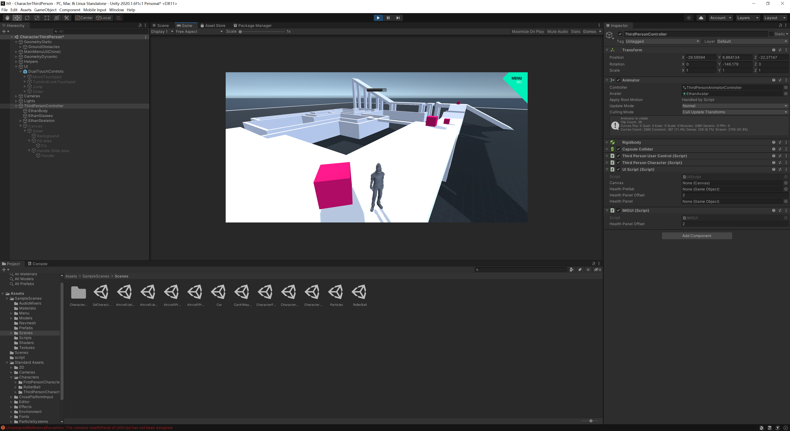

# 实现简单的血条

## 使用IMGUI实现

官方提供了OnGUI函数来开发UI界面，当然问题也比较多，首先不支持可视化开发，其次UI始终位于所有3D对象的上方，无法实现在UI上添加3D模型的效果。

IMGUI开发简单，仅需几行代码，但是IMGUI需要在将3D位置映射到屏幕位置后，如果对结果进行加减，会使得血条位置偏移过多。

只需将以下的代码挂载到实验对象时即可

```c#
using System.Collections;
using System.Collections.Generic;
using UnityEngine;

public class IMGUI : MonoBehaviour {
    public float healthPanelOffset = 2f;
    private void OnGUI()
    {
        Vector3 worldPos = new Vector3(transform.position.x, transform.position.y, transform.position.z);
        Vector2 screenPos = Camera.main.WorldToScreenPoint(worldPos);
        Rect rect = new Rect(screenPos.x -50,screenPos.y,100,100);
        GUI.HorizontalScrollbar(rect, 0, 75, 0, 100);
    }
}

```



## 使用UGUI实现

UGUI需要配合canvas来使用，所以首先来配置canvas。

1. 导入ThirdPersonController模型
2. 在controller下添加子视图canvas
3. 为canvas添加滑条slider
4. 禁用slider的handle slider area和background
5. 将fill area的fill中的image组建的color改为红色

将下列脚本挂在上去：
```c#
using System.Collections;
using System.Collections.Generic;
using UnityEngine;
using UnityEngine.UI;

public class UIScript : MonoBehaviour {
    public Canvas canvas;
    public GameObject healthPrefab;

    public float healthPanelOffset = 2f;
    public GameObject healthPanel;
    private Slider healthSlider;

    // Use this for initialization
    void Start () {
        healthPanel = Instantiate(healthPrefab) as GameObject;
        healthPanel.transform.SetParent(canvas.transform, false);
        healthSlider = healthPanel.GetComponentInChildren<Slider>();
        Vector3 worldPos = new Vector3(transform.position.x, transform.position.y + healthPanelOffset, transform.position.z);
        Vector3 screenPos = Camera.main.WorldToScreenPoint(worldPos);
        healthPanel.transform.position = new Vector3(screenPos.x, screenPos.y, screenPos.z);
    }
	
	// Update is called once per frame
	void Update () {
        Vector3 worldPos = new Vector3(transform.position.x, transform.position.y + healthPanelOffset, transform.position.z);
        Vector3 screenPos = Camera.main.WorldToScreenPoint(worldPos);
        healthPanel.transform.position = new Vector3(screenPos.x, screenPos.y, screenPos.z);
    }
}

```

